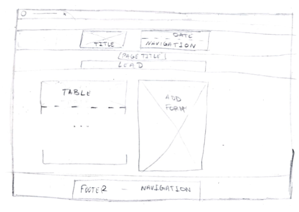

# Assigment 4: Web Applications
*Marcos E. Fernandez Calzada and Jorge Almonacid Andres*

## Part A: Developing Web Applications the abstract way

### 1. Defined routes

We defined our project route structure as the following:

- **`root`** ("/"): Same route as `/index.html`, our **landing page**.
- `/schedule.html`: Returns the template associated with **schedule** page.
- `/venue.html`: Returns template associated with **venue** page.
- `/register.html`: Returns template associated with **register** page.
	- `/register.html (method = POST)`: Sends a `POST` to our bottle server with information about a new user that just filled in the form and have purchased tickets. Updates the data base and returns the content that's been sent.
- `/speakers.html`: Connects with our data base (`conference.db`), gets all info about speakers and sends it as a parameter to the **speakers** template and the template is returned.
- `/assets`
	- `/assets/stylesheets`
		- `/assets/stylesheets/:filename`: Returns the stylesheet which name is the value of the parameter `:filename`.
	- `/assets/images`
		- `/assets/images/:page/:filename`: Returns the image in the `:page` parameter and with name in the `:filename` parameter.
- `/admin`
	- `/admin/tickets`: Fetchs all info about all tickets saved in the data base and shows them on screen for administration purposes.
		- `/admin/tickets (method = POST)`: Sends to the server new info about a new ticket filled by the administrator using a `POST` method and updates the data base.
	- `/admin/speakers`: Administration page for speakers. Admins can add new speakers, edit their info or even delete them.
		- `/admin/speakers (method = POST)`: Adds a new speaker to the data base using a `POST` like `/admin/tickets (method = POST)`.
		- `/admin/speakers/:id`: Returns from the data base the speaker which ID is the value in the parameter `:id`.
		- `/admin/speakers/:id (method = POST)`: Updates info about a speaker in the data base using `POST`.
		- `/admin/speakers/:id/delete`: Deletes the user which ID is in the `:id` parameter from the data base

### 2. Checking the code for each route

The main goal of our route was explained in *1. Defined Routes*. We think that *Bottle* is actually pretty useful, since it's easy to understand and to use, it's the best framework for us to work, but just because we're begginers and our project is relatively small, having to define thousands of routes probably can drive anyone crazy, there should be some efficient way to do it we don't know, so we're doing good with *Bottle* for this project, but we probably won't recommend it for **huge** projects.

Regarding data bases *Bottle* is simple; too simple we'd say. It just consists on injecting *SQL* in *Python* and send that code to the data base. Since relational data bases are getting slowly obsolete and the way to interact with this kind of data bases in the web carries security issues (with this kind of code it's not that hard to do a *SQL Injection* in our code to get all the information) we think that *Bottle* is perfect for learning, but we would not recommend it for actual production of web applications.

On the other hand, *Bottle* is preatty easy and efficient for implementing the bussiness logic and for building *HTML* responses, since working with templates and being able to inject *Python* code in them it's super useful and can take our implementation to another level, since our capacity to process things greatly increases.

## Part B: Building the back-end with Bottle

1. **Use the Bottle framework to create a static version of the website so that for each path a static html le is delivered or a response is generated using templates and sub-templates with the information from the above questions. For this task, instead of sharing the URL provided by Netlify when deploying the project, a compressed (.zip) package of the project folder should be delivered. Check the routes provided for stylesheets, images and other media hosted locally.** 

For this part we just defined the routes we mentioned before (just the basic ones, not the administration ones) and added a function to them, to ensure they're gonna work.

```py
@route("/")
@route("/index.html")
def index():
    return template("./conference-app/templates/index.tpl")

@route("/schedule.html")
def schedule():
    return template("./conference-app/templates/schedule.tpl")

@route("/venue.html")
def venue():
    return template("./conference-app/templates/venue.tpl")

@route("/speakers.html")
def speakers():
    conn  = sqlite3.connect('./conference-app/conference.db')
    c = conn.cursor()
    c.execute("SELECT * FROM speakers ORDER BY 3;")
    result = c.fetchall()
    c.close()
    return template("./conference-app/templates/speakers.tpl", rows = result)

@route("/register.html")
def register():
    return template("./conference-app/templates/register.tpl")


@route('/assets/stylesheets/:filename', name='css')
def stylesheets(filename):
    return static_file(filename, root='./conference-app/assets/stylesheets')

@route('/assets/images/:page/:filename', name='css')
def images(page, filename):
    return static_file(filename, root='./conference-app/assets/images/' + page)

@route("/register.html", method="POST")
def checkout():
    if request.forms.submit:
        name = request.forms.name
        email = request.forms.email
        quantity = request.forms.quantity
        comments = request.forms.comments
        conn = sqlite3.connect('./conference-app/conference.db')
        c = conn.cursor()
        #calcular numero de filas
        c.execute("SELECT COUNT(*) FROM tickets")
        rows = c.fetchone()[0] +1
        c.execute("INSERT INTO tickets (id, name, email, quantity, comments) VALUES (?, ?, ?, ?, ?)", (rows, name, email, quantity, comments))
        conn.commit()
        c.close()
    return '{name: %s, email: %s, quantity: %s, comments: %s}' % (name, email, quantity, comments)
```

2. **Imagine you are going to work on the management side of your website. Here, you could add, modify or delete people to Speakers as in the original project. Likewise, you could manage the registration of participants. I'm sure you can think of more objects to manage in your project. Make a list of URLs that you think are appropriate for your project (in the same way as we did in the previous assignment), describe their purpose and show some examples of use. Try to sketch with basic shapes (pen and paper wireframe) how the information would be displayed on the screen and how users could interact on those screens.**

We would add a special site version for the administrators. Since we only defined administrator routes for speakers and tickets we'll just need to use two different URLs:

- `www.style-conference.com/admin/tickets`
- `www.style-conference.com/admin/speakers`

This pages would be just for administrators to do the tasks we implemented in our routes; updating, adding or removing speakers or addin tickets manually.

The layout can be the similar to the rest of the web site:



\newpage

3. **Build the moderators/administrators area of your application based on the routes defined in the previous question and your conference website Bottle app built in assignment 3. Explain the bene ts of your implementation and how it can be extended.**

For this part, we defined the administration routes with its functions and methods:

```py
@route('/admin/tickets')
def admin_tickets():
    conn = sqlite3.connect('./conference-app/conference.db')
    c = conn.cursor()
    c.execute("SELECT * FROM tickets ORDER BY 1 DESC;")
    result = c.fetchall()
    c.close()
    return template("conference-app/templates/admin/tickets.tpl", rows = result)

@route('/admin/tickets', method="POST")
def admin_tickets_create():
    if request.forms.submit:
        name = request.forms.name
        email = request.forms.email
        quantity = request.forms.quantity
        comments = request.forms.comments
        conn = sqlite3.connect('./conference-app/conference.db')
        c = conn.cursor()
        #calcular numero de filas
        c.execute("SELECT COUNT(*) FROM tickets")
        rows = c.fetchone()[0] +1
        c.execute("INSERT INTO tickets (id, name, email, quantity, comments) VALUES (?, ?, ?, ?, ?)", (rows, name, email, quantity, comments))
        conn.commit()
        c.close()
        redirect('/admin/tickets') 

@route('/admin/speakers')
def admin_speakers():
    conn  = sqlite3.connect('./conference-app/conference.db')
    c = conn.cursor()
    c.execute("SELECT * FROM speakers ORDER BY 3;")
    result = c.fetchall()
    c.close()
    return template("conference-app/templates/admin/speakers.tpl", rows = result)

@route('/admin/speakers', method="POST")
def admin_speakers_create():
    if request.forms.submit:
        firstname = request.forms.firstname
        lastname = request.forms.lastname
        tagline = request.forms.tagline
        description = request.forms.description
        bio = request.forms.bio
        website = request.forms.website
        twitter = request.forms.twitter
        upload = request.files.get('upload')
        if upload:
            name, ext = os.path.splitext(upload.filename)
            if ext not in ('.jpg'):
                return "File extension not allowed."
            # upload image to the assets speakers folder
            upload.save('./conference-app/assets/images/speakers/'+firstname+"-"+lastname+ext, overwrite=True)
        conn = sqlite3.connect('./conference-app/conference.db')
        c = conn.cursor()
        c.execute("SELECT COUNT(*) FROM speakers")
        rows = c.fetchone()[0] +1
        c.execute("INSERT INTO speakers (id, firstname, lastname, tagline, description, bio, website, twitter) VALUES (?, ?, ?, ?, ?, ?, ?, ?)", (rows, firstname, lastname, tagline, description, bio, website, twitter))
        conn.commit()
        c.close()
        redirect('/admin/speakers')

@route('/admin/speakers/:id')
def admin_speaker(id):
    conn  = sqlite3.connect('./conference-app/conference.db')
    c = conn.cursor()
    c.execute("SELECT * FROM speakers WHERE id = ?", (str(id)))
    result = c.fetchone()
    c.close()
    return template("conference-app/templates/admin/speaker.tpl", row = result)


@route('/admin/speakers/:id', method="POST")
def admin_speaker_update(id):
    if request.forms.submit:
        firstname = request.forms.firstname
        lastname = request.forms.lastname
        tagline = request.forms.tagline
        description = request.forms.description
        bio = request.forms.bio
        website = request.forms.website
        twitter = request.forms.twitter
        upload = request.files.get('upload')
        if upload:
            name, ext = os.path.splitext(upload.filename)
            if ext not in ('.jpg'):
                return "File extension not allowed."
            # upload image to the assets speakers folder
            upload.save('./conference-app/assets/images/speakers/'+firstname+"-"+lastname+ext, overwrite=True)
        conn = sqlite3.connect('./conference-app/conference.db')
        c = conn.cursor()
        c.execute("UPDATE speakers SET firstname = ?, lastname = ?, tagline = ?, description = ?, bio = ?, website = ?, twitter = ? WHERE id = ?", (firstname, lastname, tagline, description, bio, website, twitter, id))
        conn.commit()
        c.close()
        redirect('/admin/speakers')


@route('/admin/speakers/:id/delete')
def admin_speaker_delete(id):
    conn = sqlite3.connect('./conference-app/conference.db')
    c = conn.cursor()
    c.execute("SELECT * FROM speakers WHERE id = ?", (str(id)))
    result = c.fetchone()
    name = result[1]+"-"+result[2]
    c.execute("DELETE FROM speakers WHERE id = ?", (str(id)))
    conn.commit()
    c.close()
    os.remove('./conference-app/assets/images/speakers/'+name+'.jpg')
    redirect('/admin/speakers')
```

4. **Based on your answer to the previous questions, describe the benefits of the Bottle framework as the back-end for the development of web applications.**

After working on this last assignment, we conclude that the most remarkable benefits of using *Bottle* as back-end framework are the following:

- **Routing**: It's simple and intuitive, easy to work with.
- **Dependencies**: *Bottle* does not use external libraries, so it's faster and has no compatibility issues.
- **Performance**: It is fast, we don't really know how would it work for high traffic websites, but for low traffic works pretty fast.
- **Server**: The *HTP* server is built inside *Bottle*, making our work much easier.
- **Weight**: It's a single file, it can't be lighter and easier than that.
- **Simplicity**: This is its most important feature; it's easy to learn and work with, it reduces complexity of this kind of tasks and lets us work faster and better.
